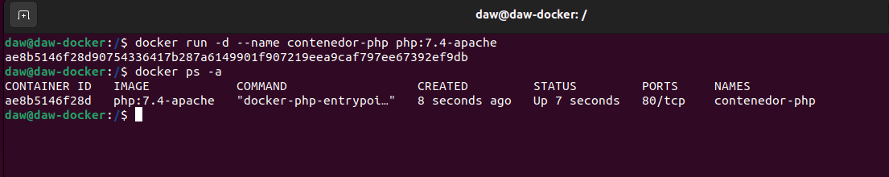
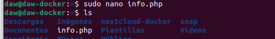
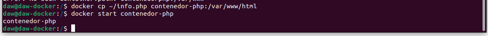
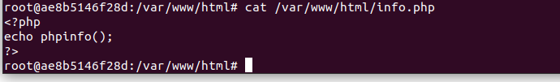
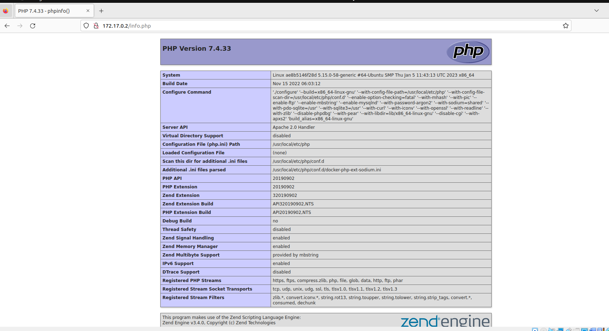
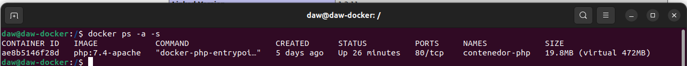
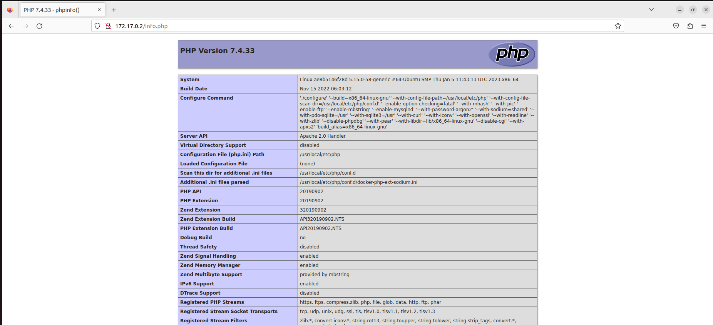

## Tares 2 - Imágenes

1. Descarga las siguientes imágenes: ubuntu:18.04, httpd, tomcat:9.0.39-jdk11,jenkins/jenkins:lts, php:7.4-apache.

Descargamos las imágenes, una a una:

```bash
docker pull ubuntu:18.04
```
```bash
docker pull httpd
```
```bash
docker pull tomcat:9.0.39-jdk11
```
```bash
docker pull jenkins/jenkins:lts
```
```bash
docker pull php:7.4-apache
```


2. Muestras las imágenes que tienes descargadas.

Mostramos la imágenes en el registro local: 

```bash
docker images
```


3. Crea un contenedor demonio con la imagen php:7.4-apache.

Creamos un contenedor demonio con la imagen php que acabamos de descargar con la opción -d para que siga activo incluso sin estar en él y con la opción --name para darle el nombre que queramos, en este caso se llamara "contenedor-php".

```bash
docker run -d --name contenedor-php php:7.4-apache
```
Comprobamos que se ha creado bien: 

```bash
docker ps -a
```



4. Comprueba el tamaño del contenedor en el disco duro.

Comprobamos ahora el tamaño del contenedor que acabamos de crear. La opción -s es size lo que indica el tamaño:

```bash
docker ps -a -s
```


Indica que nuestro espacio real del contenedor es de 2B y en virtual 453MB que incluye el tamaño de la imagen de php:7.4-apache.

5.  Con la instrucción docker cp podemos copiar ficheros a o desde un contenedor. Puedesencontrar información es esta página. Crea un fichero en tu ordenador, con el siguiente contenido: "<?php echo phpinfo(); ?>" Copia un fichero info.php al directorio /var/www/html del contenedor con docker cp.

Creamos el archivo en nuestro repositorio local.

```bash
sudo touch info.php
sudo nano info.php
ls
```



Copiamos el fichero en nuestro contenedor. Primero aseguramos el nombre de nuestro contenedor. Copiamos el archivo de nuestro repositorio a nuestro contenedor.

```bash
docker ps -a
docker cp ~/info.php contenedor-php:/var/www/html
```



Comprobamos en nuestro contenedor que está el fichero y el contenido:



Comprobamos en nuestro navegador la salida de nuestro fichero con la ip y el fichero en la url.



6. Vuelve a comprobar el espacio ocupado por el contenedor.

```bash
docker ps -a -s
````


Ahora el tamaño ha cambiado. Ha aumentado el tamaño que ocupa el espacio real del contenedor a: 19.8MB y en virtual a: 472MB.

7. Accede al fichero info.php desde su navegador.

Entramos en el navegador con nuestra ip y enlazamos con el fichero info.php y nos muestra lo siguiente:

```url
172.17.0.2/info.php
````
