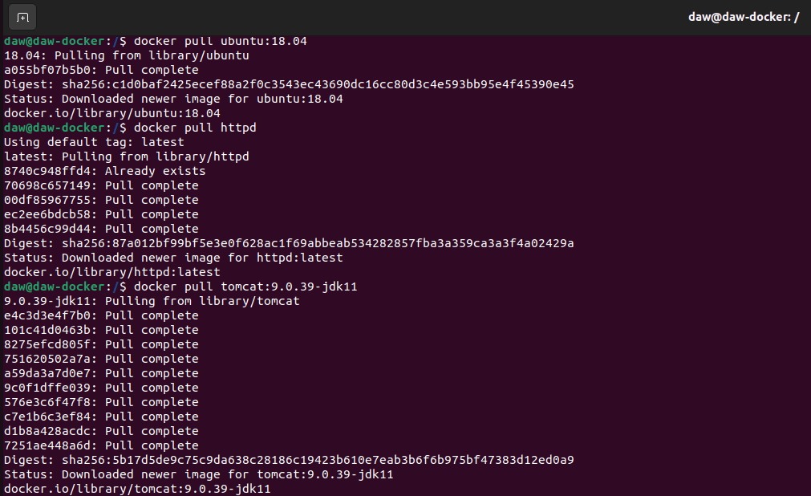
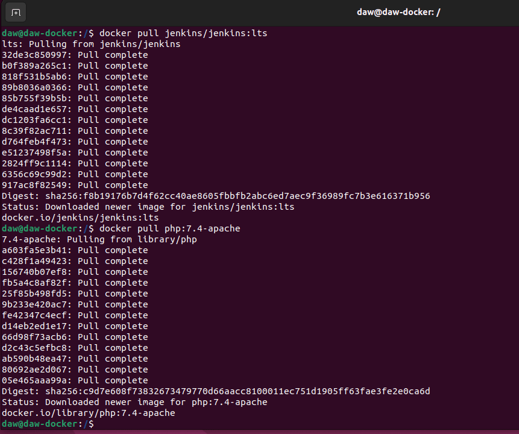
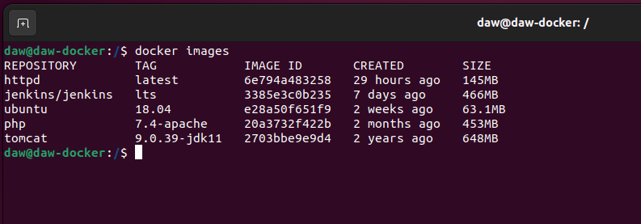

## Tares 2 - Imágenes

1. Descarga las siguientes imágenes: ubuntu:18.04, httpd, tomcat:9.0.39-jdk11,jenkins/jenkins:lts, php:7.4-apache.

Descargamos las imágenes, una a una:

```bash
docker pull ubuntu:18.04
```
```bash
docker pull httpd
```
```bash
docker pull tomcat:9.0.39-jdk11
```
```bash
docker pull jenkins/jenkins:lts
```
```bash
docker pull php:7.4-apache
```



2. Muestras las imágenes que tienes descargadas.

Mostramos la imágenes en el registro local: 

```bash
docker images
```


