## Tema 3 - Almacenamiento en Docker

Vamos a trabajar con volúmenes docker:
1. Crea un volumen docker que se llame miweb.

Creamos un volumen con el siguiente comando:

```bash
docker volume create miweb
```
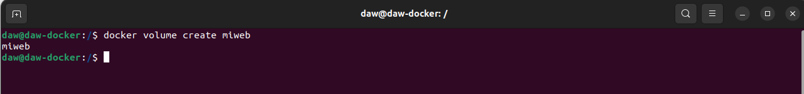

2. Crea un contenedor desde la imagen php:7.4-apache donde montes en el directorio /var/www/html (que sabemos que es el DocumentRoot del servidor que nos ofrece esa imagen) el volumen docker que has creado.

Creamos un contenedor activo con la imagen php:7.4-apache y con el directorio /var/www/html

```bash
docker run -d --name contenedor-miweb -v miweb:/var/www/html php:7.4-apache
```
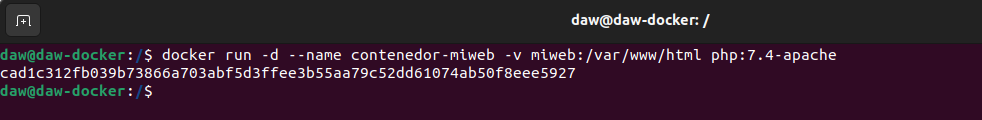

3. Utiliza el comando docker cp para copiar un fichero index.html en el directorio/var/www/html.

Creamos el fichero index.html.

```bash
sudo nano index.html
```

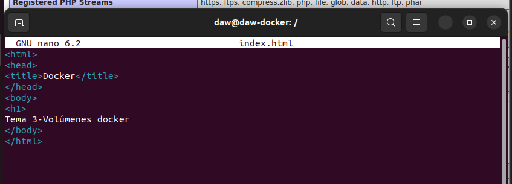

Comprobamos el contenedor, para asegurarnos del nombre y copiar bien el fichero.

```bash
docker ps -a
````

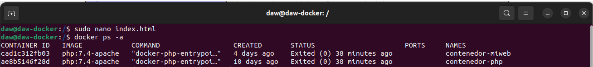

Copiamos el fichero en el contenedor en la la ruta /var/www/html

```bash
docker cp /index.html contenedor-miweb:/var/www/html
```

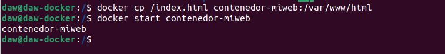

Iniciamos y entramos en el contenedor y comprobamos que es copiado bien el fichero.

```bash
docker start contenedor-miweb
docker exec -ti contenedor-miweb /bin/bash
```

Dentro del contenedor hacemos un ```ls``` para comprobar el contenido que hay en /var/www/html

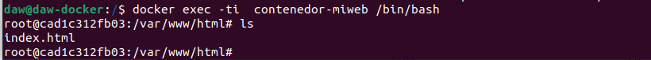

Salimos del contenedor con el comando ``` exit``` y comprobamos que el fichero también está donde lo creamos, ```ls```.

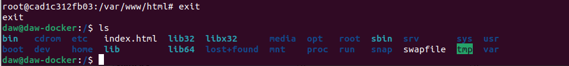

4. Accede al contenedor desde el navegador para ver la información ofrecida por el fichero index.html

Entramos en el contenedor

```bash
docker exec -ti contenedor-miweb /bin/bash
```
Y comprobamos lo que dice el fichero 

```bash
cat index.html
```

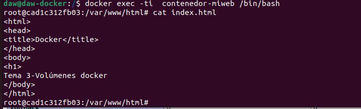

5. Borra el contenedor

Primero comprobamos que el contenedor está parado para cerrarlo.

```bash
docker ps -a
```
Al estar en marcha paramos el contenedor

```bash 
docker stop contenedor-miweb
```
Comprobamos que realmente se ha parado

```bash 
docker ps -a
```

Borramos el contenedor y comprobamos que se ha borrado 

```bash
docker rm contenedor-miweb
docker ps -a
```
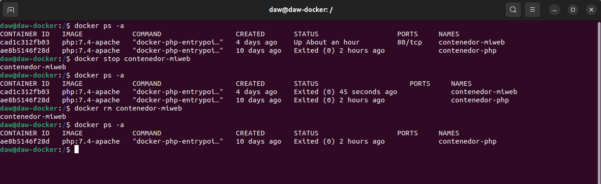

6. Crea un nuevo contenedor y monta el mismo volumen como en el ejercicio anterior.

Volvemos a crear el contenedor con el mismo volumen

```bash
docker run -d --name contenedor-miweb -v miweb:/var/www/html php:7.4-apache
```
Comprobamos que se ha creado correctamente.

```bash 
docker ps -a
```
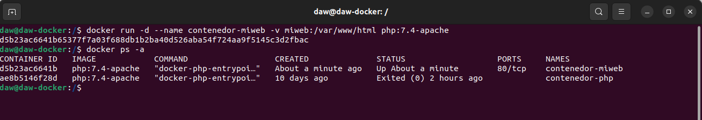

7. Accede al contenedor desde el navegador para ver la información ofrecida por el ficheroindex.html. ¿Seguía existiendo ese fichero?

Si, porque solo habíamos borrado el contenedor y no el volumen.

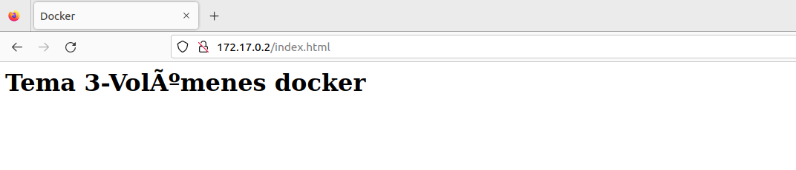

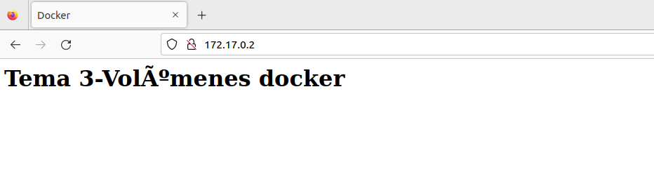

Vamos a trabajar con bind mount:

1. Crea un directorio en tu host y dentro crea un fichero index.html.

Accedemos al root y nos colocamos en nuestro directorio /home/daw.

Creamos un directorio que lo llamaremos web y nos metemos en él.
```bash
mkdir web
cd web
```
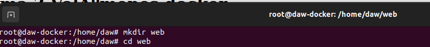

Creamos un fichero index.html

```bash
nano index.html
```

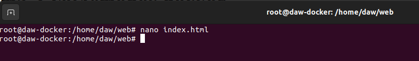
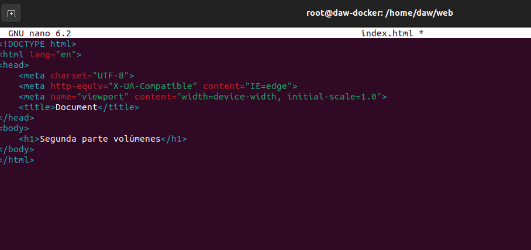

2. Crea un contenedor desde la imagen php:7.4-apache donde montes en el directorio/var/www/html el directorio que has creado por medio de bind mount.

```bash
docker run -d --name container-php -v /home/$USER/web:/var/www/html -p 8080:80 php:7.4-apache
```
Y hacemos un curl a nuestra ip en ese puerto para ver la salida:

```bash
curl http://localhost:8080
```

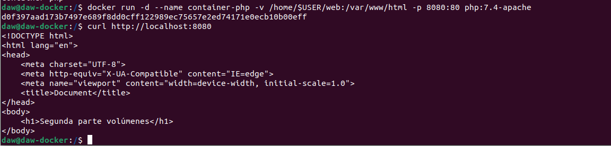

3. Accede al contenedor desde el navegador para ver la información ofrecida por el ficheroindex.html.

Accedemos al navegador para comprobar que la ip 

```url 
172.17.0.1:8080
```
nos ofrece nuestro fichero index.html

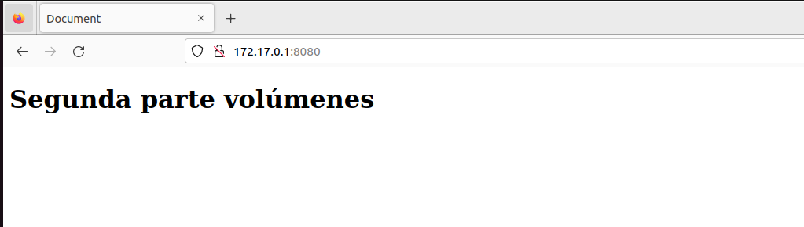

4. Modifica el contenido del fichero index.html en tu host y comprueba que al refrescar lapágina ofrecida por el contenedor, el contenido ha cambiado.

Modificamos el fichero index.html, de nuestro directorio y comprobamos que se han hecho los cambios en el fichero.

```bash
echo "<h1>Adios</h1>" > ~/web/index.html
cat ~/web/index.html
```
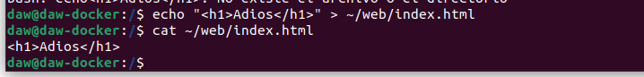

Refrescamos el navegador y comprobamos si también se ha producido el cambio.

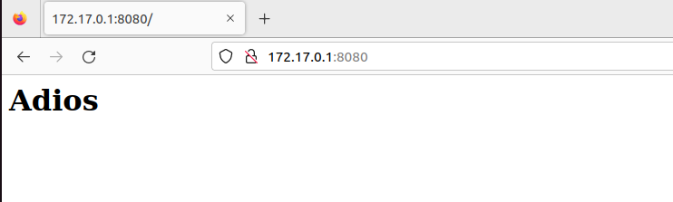

5. Borra el contenedor

Borramos el contenedor, forzandolo ya que está inicializado con el -f:

```bash
docker rm -f container-php
```
Y comprobamos que se ha borrado correctamente 

```bash
docker ps -a
```
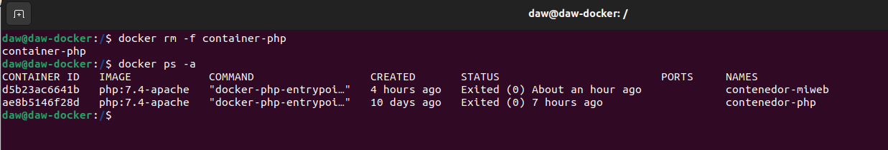

6. Crea un nuevo contenedor y monta el mismo directorio como en el ejercicio anterior.

Creamos otro contenedor como la otra vez, enlazando el directorio.

```bash
docker run -d --name c-php -v /home/$USER/web:/var/www/html -p 8080:80 php:7.4-apache
```
Comprobamos que se ha creado el contenedor

```bash
docker ps -a
```
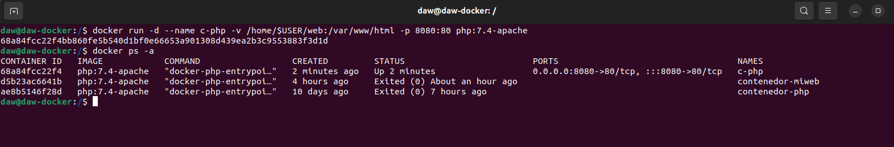


