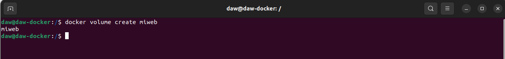
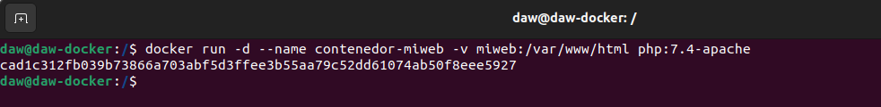
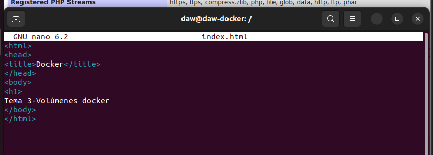
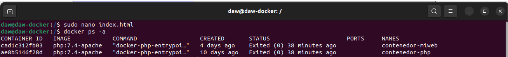
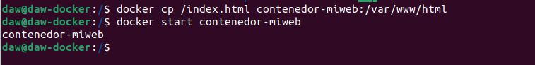
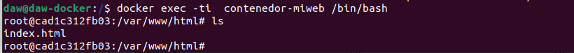
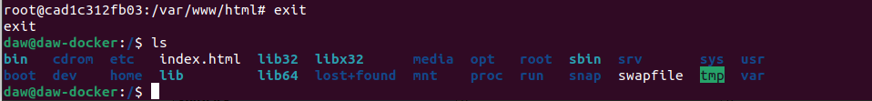

## Tema 3 - Almacenamiento en Docker

Vamos a trabajar con volúmenes docker:
1. Crea un volumen docker que se llame miweb.

Creamos un volumen con el siguiente comando:

```bash
docker volume create miweb
```


2. Crea un contenedor desde la imagen php:7.4-apache donde montes en el directorio /var/www/html (que sabemos que es el DocumentRoot del servidor que nos ofrece esa imagen) el volumen docker que has creado.

Creamos un contenedor activo con la imagen php:7.4-apache y con el directorio /var/www/html

```bash
docker run -d --name contenedor-miweb -v miweb:/var/www/html php:7.4-apache
```


3. Utiliza el comando docker cp para copiar un fichero index.html en el directorio/var/www/html.

Creamos el fichero index.html.

```bash
sudo nano index.html
```



Comprobamos el contenedor, para asegurarnos del nombre y copiar bien el fichero.

```bash
docker ps -a
````



Copiamos el fichero en el contenedor en la la ruta /var/www/html

```bash
docker cp /index.html contenedor-miweb:/var/www/html
```



Iniciamos y entramos en el contenedor y comprobamos que es copiado bien el fichero.

```bash
docker start contenedor-miweb
docker exec -ti contenedor-miweb /bin/bash
```

Dentro del contenedor hacemos un ```ls``` para comprobar el contenido que hay en /var/www/html



Salimos del contenedor con el comando ``` exit``` y comprobamos que el fichero también está donde lo creamos, ```ls```.


