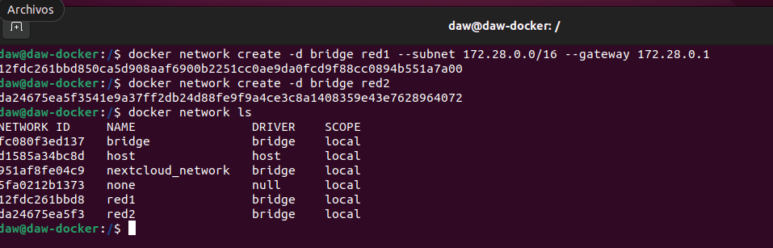
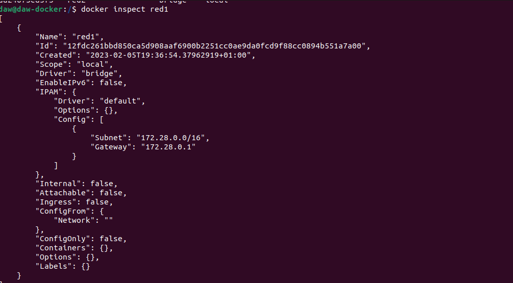
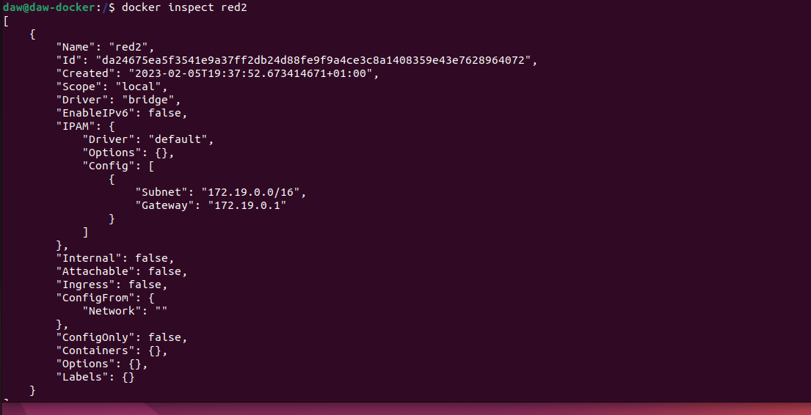
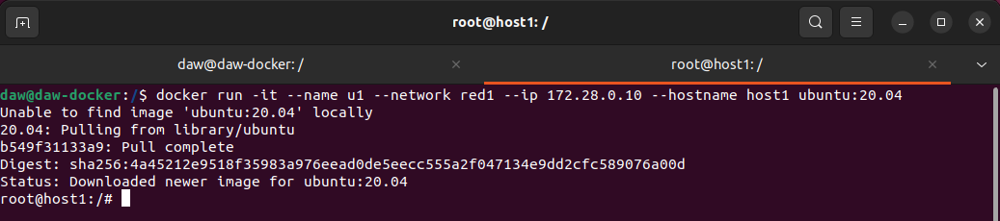
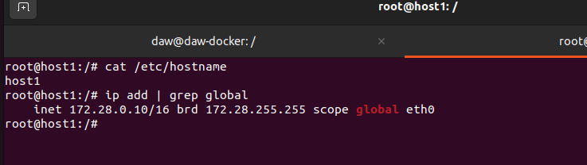
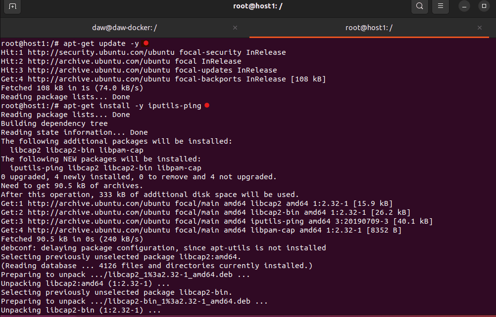
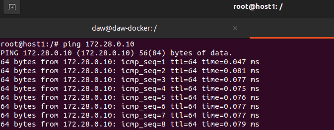
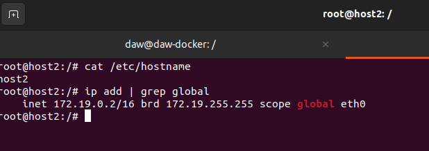
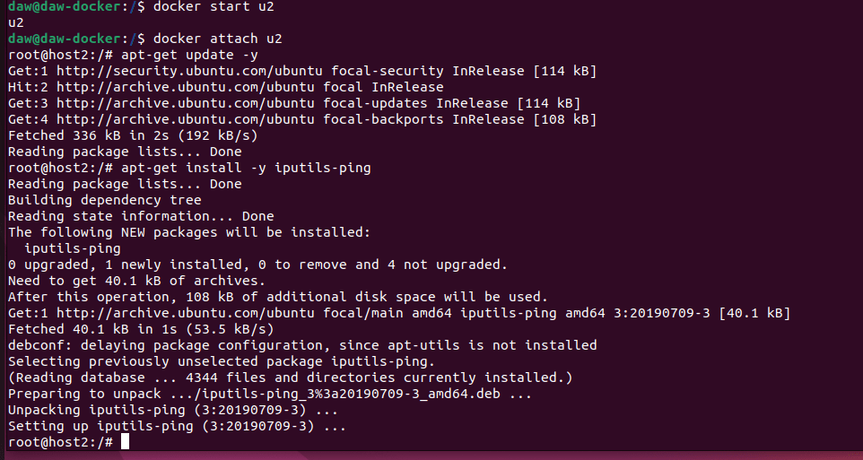
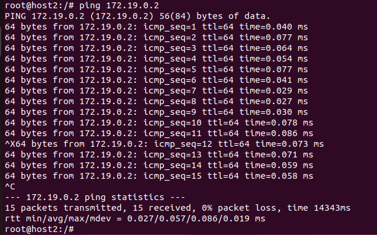

## Tema 4 - Redes en Docker

### Parte 1- Trabajar con redes docker

1. Vamos a crear dos redes de ese tipo (BRIDGE) con los siguientes datos:
 - Red1: Nombre: red1; Dirección de red: 172.28.0.0; Máscara de red: 255.255.0.0; Gateway: 172.28.0.1

- Red2: Nombre: red2. El resto de los datos será proporcionados automáticamente por Docker.

Creamos la red1

```bash
docker network create -d bridge red1 --subnet 172.28.0.0/16 --gateway 172.28.0.1
```

La ip es /16 debido a que su máscara de red.


Creamos la red2:

```bash
docker network create -d bridge red2
```







2. Poner en ejecución un contenedor de la imagen ubuntu:20.04 que tenga como hostname
host1 , como IP 172.28.0.10 y que esté conectado a la red1. Lo llamaremos u1.

Creamos un contenedor interactivo, para poder trabajar en él con el nombre u1 y con la red1 que hemos creado en el ejercicio anterior. 

La ip es la 172.28.0.10, el hostname le ponemos el nombre de host1, si no se lo ponemos sería el nombre de la IDy usamos la imagen de ubuntu:20.04.

```bash 
docker run -it --name u1 --network red1 --ip 172.28.0.10 --hostname host1 ubuntu:20.04
```


Comprobamos el contenedor:



3. Entrar en ese contenedor e instalar la aplicación ping ( apt update && apt install
inetutils-ping ).

Dentro del contenedor ponemos los siguientes comandos:

```bash
apt-get update -y
apt-get install -y iputils-ping
````


Probamos que funciona perfectamente



4. Poner en ejecución un contenedor de la imagen ubuntu:20.04 que tenga como hostname
host2 y que esté conectado a la red2. En este caso será docker el que le de una IP correspondiente a esa red. Lo llamaremos u2.

Creamos un contenedor definiendo el nombre del contenedor: u2, el nombre del host: host2 y le añadimos la red: red2. La ip se la da el propio docker (la red2 se creo con una ip que le proporcionaba docker, no se le añadió ninguna)

```bash
docker run -it --name u2 --network red2 --hostname host2 ubuntu:20.04
```


Comprobamos el contenedor:



5. Entrar en ese contenedor e instalar la aplicación ping ( apt update && apt install inetutils-ping ).

Dentro del contenedor ponemos los siguientes comandos:

```bash
apt-get update -y
apt-get install -y iputils-ping
````



Comprobamos que funciona correctamente haciendo un ping sobre la propia ip 172.19.0.2

